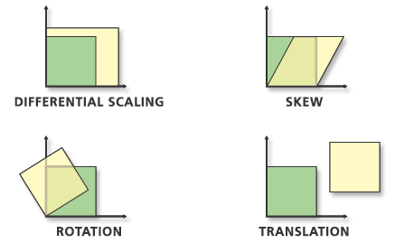
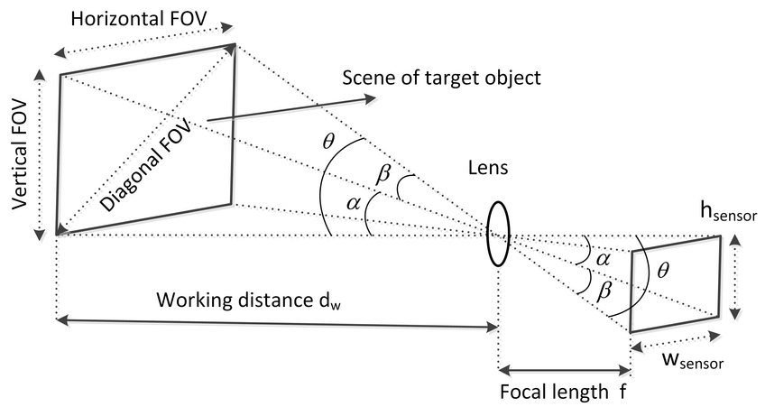

# Breaking down Gaussian Splatting (Rending only) piece by piece

[Not complete!]

I wrote this article as I was restarting my research on gaussian splatting. I wanted to document everything I did from scratch. You can always skip to the sessions you are interested in.

## My Setup
- A Dell XPS tower
  - Core i7-12700
  - 32GB RAM
  - RTX3080 10GB
  - 1TB nvme SSD

## Requirements
The following conda installs should take care of all requirements for this article. You can create a new conda env and proceed with the following.
```bash
conda create --name gs
conda activate gs
conda install python=3.8 pytorch==2.0.0 torchvision==0.15.0 torchaudio==2.0.0 pytorch-cuda=11.8 -c pytorch -c nvidia
conda install -c conda-forge cudatoolkit-dev plyfile

# install if wanted
conda install matplotlib tqdm wurlitzer ninja
```
Many of the other implementations use the official project's submodules. Also it is good to have a copy of the official code.
```bash
git clone https://github.com/graphdeco-inria/gaussian-splatting.git --recursive official
cd official
pip install submodules/diff-gaussian-rasterization
pip install submodules/simple-knn
```
The datasets can be fetched from here.
- Mip-NeRF 360's Dataset 
  - Link - ["project-page"](https://jonbarron.info/mipnerf360/). 
  - Click on "Dataset Pt.1" and "Dataset Pt.2".
  - ``wget http://storage.googleapis.com/gresearch/refraw360/360_v2.zip``
  - The above is 12GB.
  - ``wget https://storage.googleapis.com/gresearch/refraw360/360_extra_scenes.zip``
  - The above is 4.2GB.
  - Unzip them.
  - ``unzip 360_v2.zip -d 360_v2``
  - ``unzip 360_extra_scenes.zip -d 360_extra_scenes``
- Tanks and Temple Dataset(Link found from official github)
  - Click to download - ["download"](https://repo-sam.inria.fr/fungraph/3d-gaussian-splatting/datasets/input/tandt_db.zip) or use wget
  - ``wget https://repo-sam.inria.fr/fungraph/3d-gaussian-splatting/datasets/input/tandt_db.zip``
  - The above is 652MB
  - ``unzip tandt_db.zip -d tandt_db``
- The official trained models
  - Click to download- ["download"](https://repo-sam.inria.fr/fungraph/3d-gaussian-splatting/datasets/pretrained/models.zip) or use wget
  - ``wget https://repo-sam.inria.fr/fungraph/3d-gaussian-splatting/datasets/pretrained/models.zip``
  - The above is 14GB.
  - Unzip them.
  - ``unzip models.zip -d models``
- The official results
  - Link - ["Gaussian Splatting Project Page"](https://repo-sam.inria.fr/fungraph/3d-gaussian-splatting/)
  - Click on "Results 7GB" or use wget to download.
  - ``wget https://repo-sam.inria.fr/fungraph/3d-gaussian-splatting/evaluation/images.zip``
  - The above is 6.6GB.

## Some concepts to understand GS better
I might not have explained everything here, Please refer to the following notebooks for detail explanantion in comments. I have gone step by step in the form of cells in the notebook. So each cell is mostly only one calculation. Also, the steps in the previous step is abstracted and defined as a library for the next notebook. So you can skip notebooks too(run each notebook independently, start with rendering notebook, etc), but to understand completely, go through it in order. Also make sure you install all the requirements above before starting with the repo. Also make sure the file `gs_lib.py` is the next to the notebooks and next to your python/notebook files.
- `01_reading_trained_model.ipynb`. This notebook goes through how and what to extract from the trained model. The trained model is basically a `.ply` file, which contains all the gaussian points and colors, and a `.json` file which defines all the input images and camera parameters.
- `02_combine_processing.ipynb`. This notebooks explains about few other parameters that need to be calculated before rendering. The calculation uses variables from both `.ply` and `.json` file. Hence the name `combine_processing`.
- `03_render_serial_non_tile.ipynb`. This notebook finally renders an image. This does not do block/tile based rendering. Splatting is done one gaussian at a time. Its slower. It my PC, on CPU, it took around 2mins and in GPU, it took around 4mins. As it is a serial code, the CPU is faster than GPU. Also this time is for one image. SOTA gaussian splating can be done at 300 images per sec. Long way to go !!  

### Keywords(not the right definition, but simple enough words)
- Scalar = A single numerical value. E.g. 1, 0.5, 0.234
- Vector = An array of scalars. E.g. [1 2 3], [0.234 0.122 0.334]
- Matrix = A 2D array. E.g. "\[[1 1 1] [2 2 2] [3 3 3]]"
- Tensor = A multidimensional array. Can be 1D, 2D, 3D, 4D, etc. Pytorch's main datastructures are tensors.

###  PLY file format
This [wikipedia article](https://en.wikipedia.org/wiki/PLY_(file_format)) explains well about ply files. Basically it is a binary file format used for storing 3D data. They have a header segment which explains the arrangement of the binaries after the end of the header. The vertex tells the total number of points. So all properties of one point is followed by the next. E.g. [{prop1(v1), prop2(v1)}, {prop1(v3), prop2(v2)}, {prop1(v3), prop2(v3)}...,{prop1(vN), prop2(vN)}].

### Scaling and Rotation matrix
As the name suggests, Scaling matrix a three-value column vector or a 3x3 diagonal matrix that defines the scale in X,Y,Z directions for an matrix/object.


Similarly, rotation matrix defines the rotation along X,Y,Z axis, for a 3D object or a point. Its usually a full(all elements are non-zero) 3x3 matrix or 4x4 matrix with last row being [0 0 0 1]. Given a 3D vector(geometric vector, not a data structure), multiplying it with a rotation matrix, will give its new position in 3d space. You can find the derivation of this online and many on youtube. 

But in robotic, computer graphics, electronic, or real life applications, the rotations are defined using quaternions. Representing rotations using quaternions prevents a phenomenom called gimbal lock(when two axis of rotation aligns and becomes parallel. [Great video explaining gimbal lock](https://www.youtube.com/watch?v=zc8b2Jo7mno)). From [Wikipedia](https://en.wikipedia.org/wiki/Quaternions_and_spatial_rotation), quaternions give a simple way to enode a axis-angle rotation using four real numbers(compared to 9 or 16 numbered matrix). GS also uses quaternion representation for rotation of the gaussians. The "rotation" parameter which we get from the ply file is 4-value vector of quaternions. Check out this cool video from 3Blue1Brown explaining quaternions [3blue1brown on YT](https://www.youtube.com/watch?v=zjMuIxRvygQ). Also you can get a amazing interactive visualization of quaternions from here [Ben eater's Implementation](eater.net/quaternions). This is another quick 5-min [video](https://www.youtube.com/watch?v=xoTqBqQtrY4) explaining quaternion. The derivation of the formula for convert $Q$ to $R$ is given [here](https://www.songho.ca/opengl/gl_quaternion.html).

The official paper refers to this as $S$ and $R$.


### Covariance matrix
This [article](https://janakiev.com/blog/covariance-matrix/) explains covariance matrix in great detail. In short the following is calculated.
$$
\Sigma = RSS^TR^T
$$ 
In program, the multiplication is split
$$
temp = RS \\
\Sigma = temp * temp^T
$$

### Focal Length and Field of View
There are plenty of explanation online about Focal length and FOV of a camera. Also look up extrinsics and instrinsics of a camera.

The formula for calculating the FOV from Focal length is as follows.
$$
FOV_X = 2*\arctan(\frac{Width}{2*focal_x}) \\
$$
$$
FOV_Y = 2*\arctan(\frac{Height}{2*focal_y})
$$
The formuala for calculating the Focal length from FOV is as follows.
$$
Focal_X = \frac{Width}{2*\tan(\frac{FOV_X}{2})}
$$
$$
Focal_Y = \frac{Height}{2*\tan(\frac{FOV_Y}{2})}
$$

### Clipping planes
The dont render gaussians that are too close to the camera or too far from the camera. Here, when I say camera, I mean the viewpoint from which you are looking at the 3D scene. These clipping planes are a values in the Z-depth axis from the image plane. It is hardcoded to $z_{near} = 0.1$ and $z_{far} = 100$. 

### Getting translation matrix
From the JSON file, we can retrieve both camera center and the rotation matrix. This JSON file is  generated by COLMAP, a software which does Multi-View-Stereo and Structure-from-Motion. COLMAP is used to detect picture camera intrinsics+extrinsics and also camera's pose. You can read the [COLMAP Documentation](https://colmap.github.io/format.html#binary-file-format) to understand the format the JSON is generated.
To build the world-to-view transformation matrix, we need both rotation and translation matrix. We have rotation, but need to calculate translation.
The documentation explains that camera center $C$ is calculated by:
$$
C = -R^T * T
$$
where $R$ is the rotation matrix and $T$ is the translation matrix. The $^T$ represents transpose and $*$ represents matrix multiplication. From this we can calculate translation by:
$$
T = C * Inv(-R^T)
$$

### World to Camera to Image
There's plenty of resource on the web(way too much!) which explains how this works. The location of a point in real world is not the same as it appears on the image. On the image its a pixel located at a X,Y coordinate location. But real world is 3D and the point has a X,Y,Z location coordinate. The mapping of this is done by "transformation". The matrix which is multiplied to this 3D point to get a 2D pixel location is called the transformation matrix. Here are few topics to get aquianted to fully understand all the transformations that happens in GS.
- [Great video on 3d to 2d perspective projection](https://www.youtube.com/watch?v=eoXn6nwV694)
- [Lecture series on GPU programing for video games](https://www.youtube.com/playlist?list=PLOunECWxELQQwayE8e3WjKPJsTGKknJ8w)
- Pinhole camera model
- World coordinate system to camera coordinate system
- Camera calibration
- Camera intrinsics and extrinsics
- Projection matrix and Perspective Projection
- Homogeneous coordinates
- Rotation matrix
- Translation vector
- Culling
- Normalized Device Coordinates[YT video](https://www.youtube.com/watch?v=Ck1SH7oYRFM)
- [Udacity course on Interactive 3D graphics](https://www.youtube.com/playlist?list=PLAwxTw4SYaPlaHwnoGxJE7NFhEWRCIyet)

At a high level:
1. Convert all points from world-coordinate system camera coordinate system, by using rotation and translation (using camera extrinsics).
2. Do perspective projection of all the points in the camera coordinate system to image plane().
Checkout the above mentioned GPU programming lecture series. Explains the above two points really good at lecture-3 and above.

### Spherical Harmonics
The colors for each gaussian is view dependent. So the camera position is need to calculate color for each view. This is a whole lecture series on its own. Im going to skip for now. 

### Bounding radius and rectangle calculation


## Starting with the official code

## Evaluating other implementations

## Some other great resources
- [Jeremy Howard's CUDA lecture](https://www.youtube.com/watch?v=nOxKexn3iBo&t=2334s)
- [Pytorch's CUDA documentation](https://pytorch.org/docs/stable/notes/cuda.html)

## Citations
- Many of the lines and functions are verabtim-copied and few influenced from other implementations on github. I will try my best to get the links and give proper citations to the original authors. I apologize if I missed to cite any source.
- [Official implemnetation](https://github.com/graphdeco-inria/gaussian-splatting)
- [hbb1's torch-splatting](https://github.com/hbb1/torch-splatting)
- [wangfeng18's gaussian splatting](https://github.com/WangFeng18/3d-gaussian-splatting)
- [arnaudstiegler's pure torch GS implementation](https://github.com/arnaudstiegler/torch-gaussian-splatting-rasterizer)
- [MrNerf's awesome-gaussian-splatting](https://github.com/MrNeRF/awesome-3D-gaussian-splatting)

### Pictures
- [FOV Pic](https://www.arducam.com/focal-length-calculator/)

## Scratchpad (Ignore. For self notes and todos)
### Todos
- [ ] Add titles to the notebooks
- [ ] Parallelize
- [ ] Create notebooks for official implementation and other implementation
- [ ] Test notebooks on macos with apple silicon (on MPS) 

### Commands used
```bash
./ffmpeg.exe -i ../../../../COLMAP/uic_logo/IMG_0922.MOV -vf "fps=10,scale=480:640" -q:v 2 ../../../../COLMAP/uic_logo/input/%04d.jpg

time python train.py -s ../Tools/COLMAP/uic_logo2 --densification_interval 1000
```
